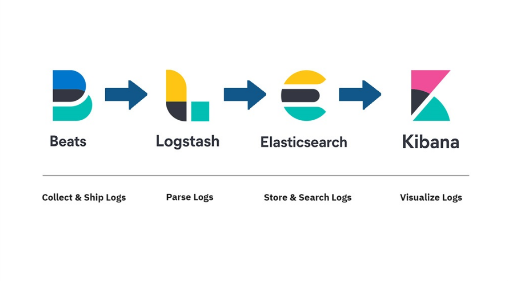
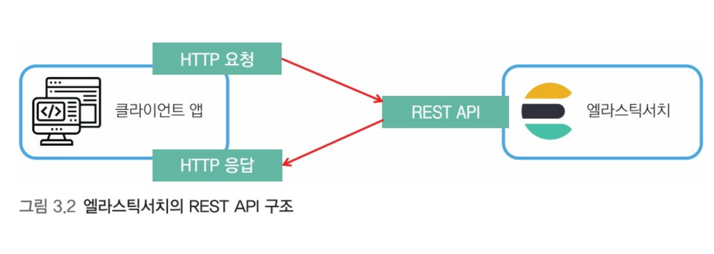
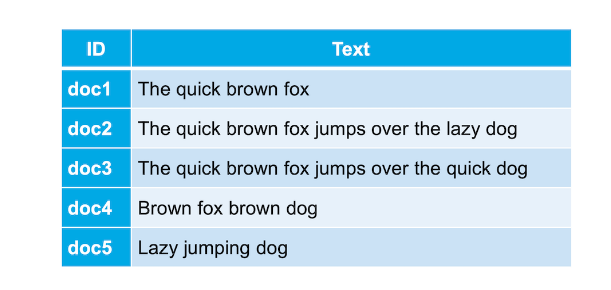
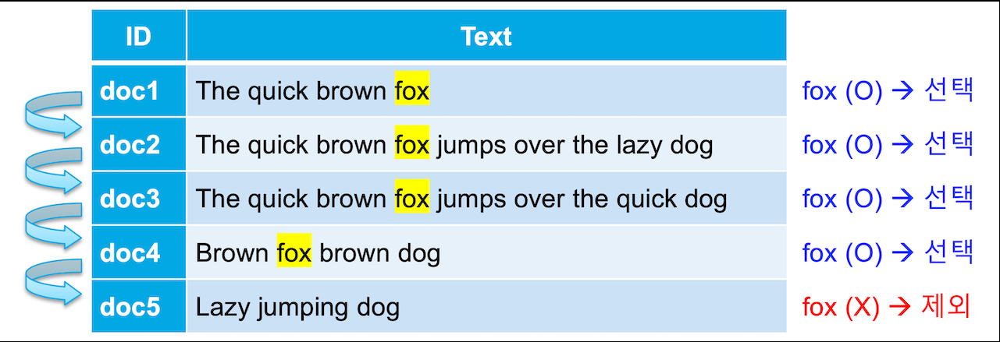

# Elastic Stack



---

## 목차

1. 엘라스틱서치 CRUD
2. RDBMS의 색인
3. 엘라스틱 서치의 색인
4. 분석기

---

# 엘라스틱서치 CRUD

| 메서드 | 설명               | 메서드 | 설명               |
| ------ | ------------------ | ------ | ------------------ |
| POST   | 해당 리소스를 추가 | GET    | 해당 리소스를 조회 |
| PUT    | 해당 리소스를 수정 | DELETE | 해당 리소스를 삭제 |

- **엘라스틱서치는 모든 요청과 응답을 REST API 형태로 제공**
- 6.x 부터 PUT과 POST를 엄격히 구분하지 않고 사용을 한다.

---

## RESTFul API



**Restful API**를 통해 index에 document를 추가할 수 있는데,  
이러한 작업을 **문서를 색인화** 한다 지칭

---

## 인덱스 만들기

```bash
PUT customer?pretty
```

- **PUT 메서드**를 사용하여 **customer**라는 **색인**을 생성
- **pretty**의 경우 reponse(결과)를 예쁘게 보여주기 위함

```json
{
  "acknowledged": true, // 응답 결과 여부
  "shards_acknowledged": true, // 필요한 수의 shard copy의 시작 유무
  "index": "customer" // 생성된 데이터 베이스(인덱스)명
}
```

---

## 인덱스 조회

```json
GET /_cat/indices?v
```

- **GET**: HTTP 메서드명
- **\_cat**: 엘라스틱서치에서 제공해주는 API
- **indices**: 복수의 인덱스를 의미

```shell
health status index                             uuid                   pri rep docs.count docs.deleted store.size pri.store.size
yellow open   filebeat-7.16.2-2021.12.23-000001 _vAVYsNlT5OBFWhrZl2N4w   1   1          0            0       226b           226b
green  open   .geoip_databases                  pX5UN4wESS-vCV5AoEuhxQ   1   0         44           43     43.6mb         43.6mb
green  open   .kibana_task_manager_7.16.2_001   JwZwWmBvQv20SgLrQainDw   1   0         17         5733      1.8mb          1.8mb
```

---

## 엘라스틱 서치에서 제공하는 API

```shell
## _언더바                            : API를 의미
## _cat/health?v                     : 현재 클러스터의 상태
## _cat/nodes?v                      : 노드 상태
## _update                           : 특정 데이터 업데이트
## _search                           : 데이터 전체 조회
## ?v                                : 상세 정보 확인
```

- 기본적으로 자주 사용이 되는 API 리스트

---

## 데이터 삽입

```json
POST tourcompany/customerlist/1
{
  "name": "Alfred",
  "phone": "010-1234-5678",
  "holiday_dest": "Disneyland",
  "departure_date": "2017/01/20"
}
```

- **index**: tourcompany
- **type**: customerlist
- **id**: 1

---

## 데이터 삽입 성공

```json
{
  "_index" : "customer",
  "_type" : "type1",
  "_id" : "1", ## document => 지정하지 않을 시 랜덤으로 들어간다
  "_version" : 1,
  "result" : "created",
  "_shards" : {
    "total" : 2,
    "successful" : 1,
    "failed" : 0
  },
  "_seq_no" : 0,
  "_primary_term" : 1
}
```

---

## 데이터 삭제

```shell
DELETE customer/type1/1
```

- 데이터 삭제 시 **인덱스**, **타입**, **Id**를 지정
- POST와는 다르게 **바디 영역**이 존재하지 않는다.

---

## 데이터 삭제 성공

```json
{
  "_index" : "customer",
  "_type" : "type1",
  "_id" : "1",
  "_version" : 2,
  "result" : "deleted", # 삭제 여부
  "_shards" : {
    "total" : 2,
    "successful" : 1,
    "failed" : 0
  },
  "_seq_no" : 1,
  "_primary_term" : 1
}
```

---

## 데이터 수정

```json
# 아래 명령어를 통해 document의 일부분을 변경할 수 있다
POST customer/type1/1/_update
{
  "doc" : {
    "age" : 123
  }
}

# 해당 명령어는 document 전체를 갈아끼우는 방법
POST customer/type1/1
{
  "name": "ymkim"
}
```

---

# RDBMS의 색인


- **MySQL**, **MS-SQL**, **MariaDB** 등등

---

## Ⅰ 일반적인 데이터베이스 인덱싱(Indexing)



- 일반적인 데이터베이스(MySQL, MS-SQL)는 **단방향 색인**을 사용
- 대표적으로 **Like 검색**을 사용

---

## Ⅱ 일반적인 데이터베이스 인덱싱(Indexing)



- **특정 키워드**를 찾기 위해서는 **Full Scan**을 수행 해야한다
- **상단한 연산**을 수반
- **별도의 캐싱 로직**을 추가하지 않는 이상 **같은 작업을 반복**

---

# :thinking: 엘라스틱 서치의 색인?


- 엘라스틱 서치는 기본적으로 **역색인**을 사용한다

---

## Ⅰ [엘라스틱 서치의 역색인](https://jiseok-woo.tistory.com/3)


1. 엘라스틱 서치는 데이터 저장 시 의미있는 **단어들을 추출**
2. 해당 단어들로 역색인(Inverted Index)를 생성
3. 단어를 검색시 **어떤 도큐먼트**에 **해당 단어가 포함되 있는지** 확인 가능

---

## Ⅱ 엘라스틱 서치의 역색인


- 데이터가 늘어나도 찾아가야 할 행이 늘어나는 것이 아니라 `역 인덱스가 가리키는 id의 배열값이 추가되는 것 뿐`이기 때문에 큰 속도의 저하 없이 빠른 속도로 검색이 가능합니다

---

# 분석기?


---

## Ⅰ 분석에 필요한 구성 요소

#### 전처리 필터 - CharFilters

- 원문에서 불필요한 문자를 제거한다
- 문자열 자체가 분리된것이 아닌, 필터링 된 문자열

---

## Ⅱ 분석에 필요한 구성 요소

#### 토크나이저 필터 문자 분리 방법

- **standard tokenizer**
  - 기호 기준
- **whitespace tokenizer**
  - 공백 기준
- **ngram tokenizer**
  - 한 글자씩
- **keyword tokenizer**
  - 분리하지 않음

---

## Ⅲ 분석에 필요한 구성 요소

#### 토큰 필터

- **Ascii Folding**
  - ASCII
- **Lowercase**
  - 소문자
- **Uppercase**
  - 대문자
- **Stop**
  - 불용어 사전을 구축하여 검색되지 않을 단어 지정

---

- **Synonym**
  - **동의어 처리**를 위한 필터, 비슷한 뜻으로 쓰이는 단어를 묶는다
  - ex) 애플 검색 → 아이폰 검색 결과를 포함하여 표시
- **Trim**
  - 공란 제거

---

### 참고 자료

- [Elasticsearch 개발부터 운영까지](http://www.yes24.com/Product/Goods/103030516) 📌
- [6.1 역 인덱스 - Inverted Index](https://esbook.kimjmin.net/06-text-analysis/6.1-indexing-data)
- [6.2 텍스트 분석 - Text Analysis](https://esbook.kimjmin.net/06-text-analysis/6.2-text-analysis)
- [Character filters reference](https://www.elastic.co/guide/en/elasticsearch/reference/current/analysis-charfilters.html)
- [Elasticsearch 분석](https://nesoy.github.io/articles/2019-03/ElasticSearch-Analysis)
- [Analysis & Analyzer](https://u2ful.tistory.com/28)
